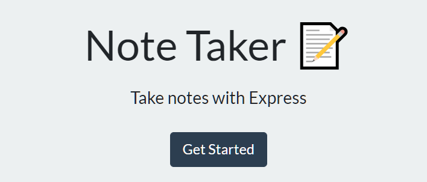
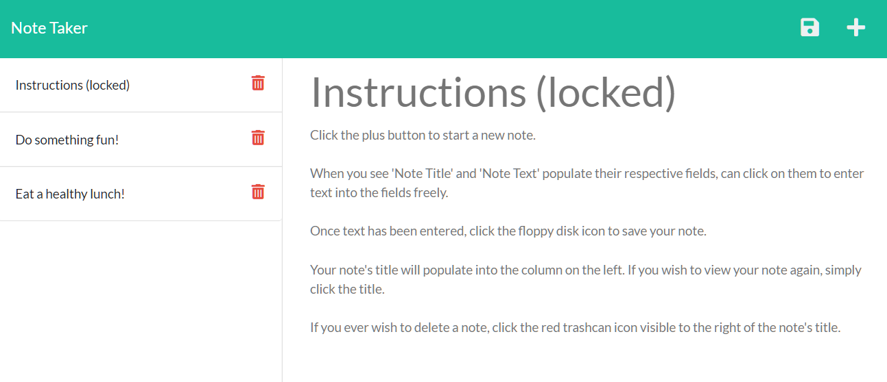

# Note Taker

## Table of Contents
* [Description](#description)
* [Installation](#installation)
* [Usage](#usage)
* [License](#license)
* [Questions](#questions)

## Description

A simple note-taking app that allows the user to dynamically update a notes database using express.js.

## Installation

Follow the below steps to install the program:

        npm install

## Usage

To use Note Taker, simply navigate from the landing page to the notes page, and start making notes! 

Click the plus sign to make a new note, click the note titles that generate to review what you've written, and click the red trashcan to dump old notes in the bin!

You can try out the working app [HERE!](https://note-taker-sgm86.herokuapp.com/notes)

## Questions

For more information, feel free to contact me:

GitHub: [github.com/stevengoldbergm](https://github.com/stevengoldbergm)
